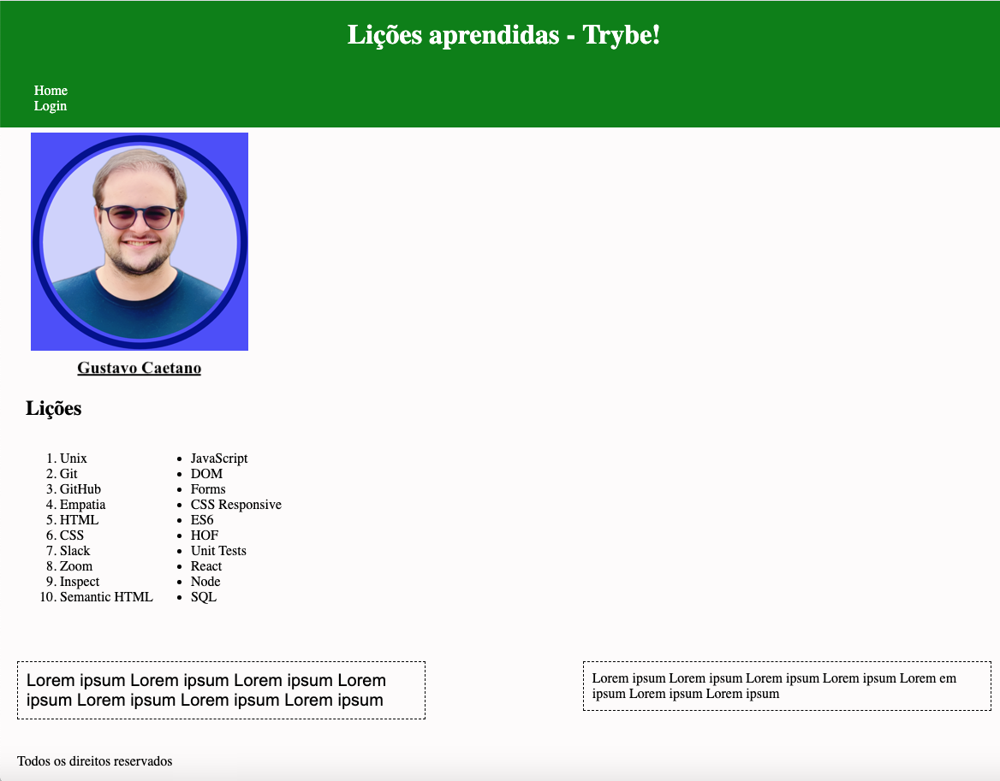

<!-- markdownlint-disable MD033 -->
# 📚 Lições Aprendidas

## 🖥️ Sobre o Projeto
Este projeto foi desenvolvido como parte do meu aprendizado na **Trybe**, com o objetivo de aplicar e aprimorar minhas habilidades em **HTML** e **CSS**. Construí uma página que apresenta as lições que absorvi ao longo do curso, garantindo um design acessível e uma estrutura semântica adequada.

## 🚀 O que foi desenvolvido?
- Uma **página HTML** bem estruturada e estilizada com **CSS**.
- Implementação de boas práticas semânticas para **acessibilidade e SEO**.
- Posicionamento e estilização de elementos para uma experiência agradável.

## 🛠️ Tecnologias Utilizadas
- 🏗️ **HTML5** - Para estruturação do conteúdo.
- 🎨 **CSS3** - Para estilização e responsividade da página.

## 💡 Aprendizados
Durante o desenvolvimento deste projeto, **aperfeiçoei meu entendimento sobre**:
- A importância da **semântica** no HTML.
- Estruturação de **layouts** utilizando CSS.
- Melhores práticas para um **código limpo e organizado**.

## 🧑‍💻 O que deverá ser desenvolvido

Você vai desenvolver um site com uma série de informações sobre o que você aprendeu aqui na Trybe ao longo dos últimos conteúdos. O seu site deverá estar com elementos posicionados e estilizados e, além disso, deverá conter semântica apropriada para que seja acessível e melhor ranqueado.

  
🖼️ 💡Veja no exemplo a seguir como pode ser a aparência do projeto depois de pronto. Lembre-se de que você pode e deve ir além para deixar o projeto com a sua cara e impressionar todas as pessoas!

  

## Requisitos

### 1. Adicione uma cor de fundo específica para a página

  
<strong>Mais informações:</strong>

A página deve possuir a cor de fundo <code>rgb(253, 251, 251)</code> em seu corpo.

- **O que será testado:**

- A página deve possuir cor de fundo: `rgb(253, 251, 251)` em seu corpo.

### 2. Adicione uma barra superior com um título

  
<strong>Mais informações:</strong>

Essa barra superior deve possuir o <code>id</code> igual a <code>cabecalho</code> e deve ser fixa no topo da página com a propriedade <code>top</code> tendo <code>0</code>. O título deve estar dentro da barra e ser um elemento <code>h1</code> com <code>id</code> igual a <code>titulo</code>.

- **O que será testado:**

- A barra deve possuir o ID `cabecalho`;
- A barra superior deve ser fixa no topo da página;
- A barra deve ter a propriedade `top` tendo o valor `0`;
- O título deve estar dentro da barra e possuir o ID `titulo`, além de ser uma tag `h1`.

### 3. Adicione uma foto sua à página

  
<strong>Mais informações:</strong>

A foto deve ser inserida utilizando uma tag <code>img</code> com o ID <code>minha_foto</code>.

- **O que será testado:**

- A foto deve ser uma tag `img` e possuir o ID `minha_foto`.

### 4. Adicione uma lista de lições aprendidas à página

  
<strong>Mais informações:</strong>

A lista deve possuir <strong>10</strong> itens, ser numerada e possuir o ID <code>licoes_aprendidas</code>.

- **O que será testado:**

- A lista deve ser numerada;

- A lista deve possuir o ID `licoes_aprendidas`;

- A lista deve possuir 10 itens.

### 5. Crie uma lista de lições que ainda deseja aprender para a página

  
<strong>Mais informações:</strong>

A lista deve possuir <strong>10</strong> itens, não ser numerada e possuir o ID <code>licoes_a_aprender</code>.

- **O que será testado:**

- A lista não deve ser numerada;
  
- A lista deve possuir o ID `licoes_a_aprender`;

- A lista deve possuir 10 itens.

### 6. Adicione um rodapé para a página

  
<strong>Mais informações:</strong>

O rodapé deve utilizar a tag <strong>footer</strong> e possuir o ID <code>rodape</code>.

- **O que será testado:**

- O rodapé deve possuir a tag `footer`;

- O rodapé deve possuir o ID `rodape`.

### 7. Insira pelo menos um link externo na página

Mais informações:

O link deve redirecionar a pessoa usuária para uma nova aba do navegador.

- **O que será testado:**

- O link deve ser aberto em nova aba no navegador.

### 8. Crie um artigo sobre o seu aprendizado

  
<strong>Mais informações:</strong>

  O artigo deverá ser uma tag HTML `<article>` e deve possuir mais de 300 <strong>caracteres</strong> e menos de 600.

- **O que será testado:**

  - O artigo deve possuir a tag `<article>`.
  - O artigo deve ter mais de 300 caracteres e menos de 600.

### 9. Crie uma tag HTML `aside` que contenha uma breve descrição sobre você

  
<strong>Mais informações:</strong>

  A tag `<aside>` deverá possuir mais de 100 <strong>caracteres</strong> e menos de 300.

- **O que será testado:**

  - A tag `aside` deve ser utilizada.
  - A sua descrição deve ter mais que 100 caracteres e menos que 300.

### 10. Aplique elementos HTML de acordo com o sentido e propósito de cada um deles

  
<strong>Mais informações:</strong>

  A sua página deve conter os seguintes elementos: `<article>`, `<header>`, `<aside>`, e `<footer>`.

- **O que será testado:**

  - A página deve possuir um elemento `article`.
  - A página deve possuir um elemento `header`.
  - A página deve possuir um elemento `aside`.
  - A página deve possuir um elemento `footer`.

### 11. Teste a semântica da sua página usando o site [CodeSniffer](https://squizlabs.github.io/HTML_CodeSniffer/)

  
<strong>Mais informações:</strong>

  Teste se a semântica da sua página está aprovada pelo site [CodeSniffer](https://squizlabs.github.io/HTML_CodeSniffer/).

- **O que será testado:**

  - A sua página deve passar com `0 errors` na verificação de semântica do site [CodeSniffer](https://squizlabs.github.io/HTML_CodeSniffer/).

